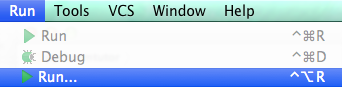
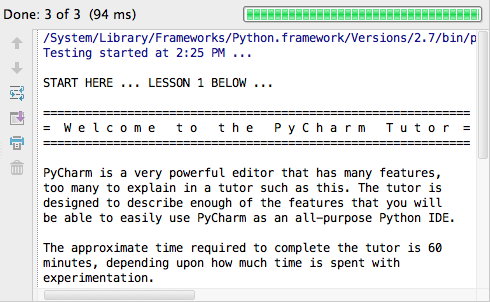

# Pycharm Tutor

Please reference the [slides from the PyTennessee (2014)](http://slid.es/tsclausing/pycharmtutor/fullscreen)
tutorial session.

In the spirit of `vimtutor`, let there be PyCharm Tutor.

    ===============================================================================
    =           W e l c o m e   t o   t h e   P y C h a r m   T u t o r           =
    ===============================================================================

Learn PyCharm by _Using_ PyCharm.

# Lesson 0: START HERE!

1. Install [PyCharm Community Edition](http://www.jetbrains.com/pycharm/download/)
2. Clone this repo, `git clone https://github.com/tsclausing/pycharmtutor.git`
3. Then, `charm pycharmtutor`

If step 3 doesn't open the pycharmtutor project in PyCharm, try opening PyCharm
the old fashioned way, then and choose "Open Directory" from the welcome screen and
select your cloned pycharmtutor directory.

From the PyCharm menu, select `Run -> Run...` and hit return to select the default
test configuration and run the Unittests!

__You're in.__ Read the test console output for next steps. All of the PyCharm Tutor(ial)
lessons are python files meant to be viewed *in* PyCharm.  Read everything, try
anything, have fun :)

.

.

.

.

.

# You finished Lesson 1? Great!

If you didn't work through lesson one first, you're going to have a bad time.

    ===============================================================================
    =                  P y C h a r m   T u t o r   L e s s o n s                  =
    ===============================================================================

The pycharmtutor lessons don't need to be run in order, so feel free to jump around.
Using your skills from Lesson 1, jump to any of the lesson files in the `lessons/`
directory!

## lessons/basic/

These few lessons will get you from 0 to developing in PyCharm in 60 minutes:

* idenlightenment.py - Simple charms to bewitch the mind and ensnare the senses.
* analyze.py - Code analysis, inspection, and the all seeing eye.

# Lesson Roadmap

The following lessons are planned or in development.

* Code completion and inline docs
* Managing dependencies
* Running a script
* Debugging a script
* Running unit tests
* Refactoring project code
* Local history

PyCharm's version control integrations are extraordinary. One merge and you'll
never go back:

* Changes
* Diff
* Branch
* Commit
* Merge

These lessons continue to improve your efficiency and make your PyCharm
experience just that much more enjoyable:

* No-mouse PyCharm Navigation
* Useful plugins
* Multiple interpreters and virtual environments
